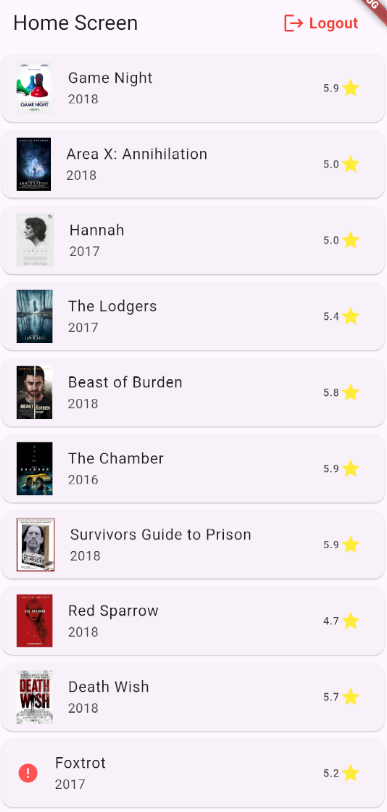
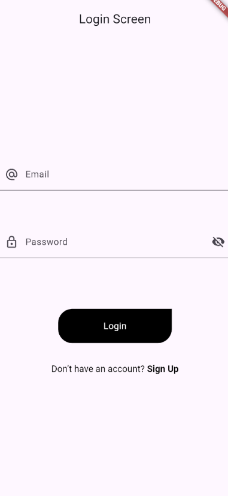
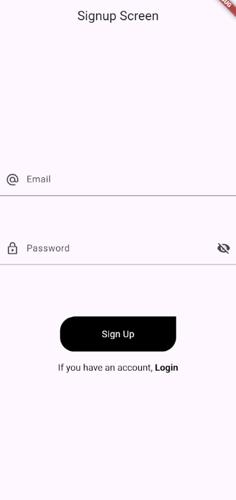

# Flutter MVVM Architecture

This project demonstrates a **Flutter MVVM (Model-View-ViewModel) Architecture** for building scalable and maintainable Flutter applications.

## 🚀 Features
- **MVVM Architecture**: Separation of UI, business logic, and data layers.
- **Provider State Management**: For efficient state management.
- **API Integration**: Uses clean service and repository patterns.
- **Reusable Components**: Shared widgets like buttons for modularity.
- **Routing**: Organized navigation with named routes.
- **Error Handling**: Structured API response handling and exception management.

---

## 🗂️ Project Structure

```
lib/
│   main.dart                      # Entry point of the app
│
└── data/                          # Data layer
    └── network/                   # API services
    │   │   base_api_services.dart
    │   │   network_api_services.dart
    │
    └── response/                  # API response & status
        │   app_response.dart
        │   status.dart
        app_exceptions.dart        # Custom exception handling

└── models/                        # Data models
    │   movie_list_model.dart
    │   user_model.dart

└── provider/                      # Repositories
    │   auth_repository.dart
    │   movie_list_repository.dart

└── res/                           # Resources
    │   app_url.dart               # API URLs
    │   colors.dart                # App colors
    └── components/
        │   round_button.dart      # Reusable buttons

└── utils/                         # Utilities
    │   utils.dart
    │   utils_reference.dart
    └── routes/
        │   routes.dart            # Route management
        │   routes_name.dart       # Named routes

└── view/                          # UI screens
    │   home_screen.dart
    │   login_screen.dart
    │   signup_screen.dart
    │   splash_screen.dart

└── vm/                            # ViewModels
    │   auth_view_model.dart
    │   movie_list_view_model.dart
    │   user_view_model.dart
    └── services/
        │   splash_services.dart   # Services
```

---

##  🗂️ Setup Project Structure

To set up the MVVM structure in your Flutter project, run the following commands:

```bash
mkdir -p lib/data/{network,response}
mkdir -p lib/models
mkdir -p lib/provider
mkdir -p lib/res/{components}
mkdir -p lib/utils/{routes}
mkdir -p lib/view
mkdir -p lib/vm/{services}

```

## 📦 Dependencies

Add the following dependencies to your `pubspec.yaml`:

```yaml
dependencies:
  flutter:
    sdk: flutter
  http: ^1.2.2   
  fluttertoast: ^8.2.10   
  another_flushbar: ^1.12.30   
  provider: ^6.1.2
  shared_preferences: ^2.3.3
```

---

## 🛠️ How to Run

1. **Clone the Repository**:
   ```bash
   git clone https://github.com/your-username/flutter_mvvm_architecture.git
   cd flutter_mvvm_architecture
   ```

2. **Install Dependencies**:
   ```bash
   flutter pub get
   ```

3. **Run the Application**:
   ```bash
   flutter run
   ```

---

## 🧬 Key Features Explained

### **MVVM Architecture**
- **Model**: Represents the data structure (e.g., `movie_list_model.dart`).
- **View**: UI screens like `home_screen.dart` and `login_screen.dart`.
- **ViewModel**: Business logic layer. Fetches data via repositories and services.

### **Provider for State Management**
The app uses the `Provider` package to manage state efficiently between UI and ViewModels.

### **API Handling**
- Services and repositories handle API calls using clean abstractions.
- Errors are managed through `app_exceptions.dart` and `status.dart`.

---

## 📱 Screenshots

| Home Screen                        | Login Screen                        | Sign Up Screen                  |
|-----------------------------------|------------------------------------|----------------------------------------|
|   |  |  |

---

## 🌐 API Details
This project fetches movie data from an API. Replace the `app_url.dart` file with your actual API endpoint.

Example `app_url.dart`:
```dart
class AppUrl {
  // static var baseUrl ='https://bft.com/api';
  static var baseUrl = 'https://reqres.in';
  // static var loginUrl = '$baseUrl/login';
  static var loginUrl = '$baseUrl/api/login';
  static var registerUrl = '$baseUrl/api/register';

  static var movieBaseUrl = 'https://dea91516-1da3-444b-ad94-c6d0c4dfab81.mock.pstmn.io';

  static var movieListUrl = '$movieBaseUrl/movies_list';

}

```

---

## 🛠️ Future Improvements
- Add unit testing for ViewModels.
- Implement BLoC or Riverpod as alternatives for state management.
- Add caching for offline support.
- Integrate pagination for large datasets.

---

## 🪶 Contributing
Contributions are welcome! Feel free to fork this repository and submit a pull request.

---

## 📜 License
This project is licensed.

---

## 👨‍💻 Author
- **Siddharth Chitrala**
- GitHub: [Siddharth Chitrala](https://github.com/SiddharthChitrala)
- Email: chitrala.saisiddharthkumar7@gmail.com
